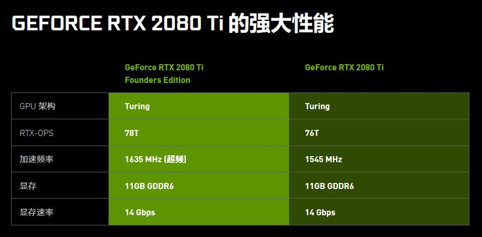
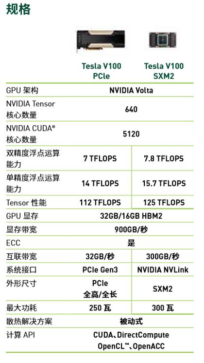

# GPU

## Introduction

### A Comparison between the CPU and the GPU

A simple method to understand the difference between a GPU and a CPU is to compare how they handle tasks. Architecturally, the CPU is composed of just a few cores with lots of cache memory that can handle a few software threads at a time. In contrast, a GPU is composed of hundreds of cores that can handle thousands of threads simultaneously. The ability of a GPU with 100+ cores to process thousands of threads can accelerate some software by 100x over a CPU alone. What’s more, the GPU achieves this acceleration while being more power- and cost-efficient than a CPU.

The CPU is like a multifunctional excellent leader, whose advantages are its ability to schedule, manage, and coordinate, and its computing power is second. The GPU is equivalent to an employee who has a large amount of computing power under the control of the CPU.

The GPU can use multiple CUDA cores for parallel computing, while the CPU can only perform serial calculations in sequence. If they are about to run 3,000 simple operations, the CPU takes 3,000 clock cycles, and the GPU with 3000 CUDA cores only needs to run 1 clock cycle.

In short, the CPU is good at complex operations, and the GPU is good at simply repeating operations to big data.

## Indicators

### Clock Speed
Similar to the CPU clock speed, the GPU clock speed refers to the clock speed at full speed.

### Memory Capacity

Its main function is to temporarily store the data to be processed by the GPU. The amount of memory capacity determines how much data the GPU can load. In the case that the memory can already satisfy the customer's needs, the improvement of the memory will not bring about better performance. In the training scene of deep learning and machine learning, the size of the memory determines the amount of training data that can be loaded at one time. When it comes to training in a large scale, GPU memory will be more important.

### Memory Interface Width

The number of bits of data that can be transmitted in one clock cycle. The larger the number of bits, the larger the amount of data that can be transmitted in an instant.

### Memory Bandwidth

It refers to the data transfer rate between the display chip and the video memory, in bytes per second. Memory bandwidth is one of the most important factors in determining graphics card performance and speed.

### Calculation Abilities

There are double-precision, single-precision, and half-precision performance.

For floating-point calculations, the CPU can support different precisions. However, in the GPU, separate arithmetic units are required for single-precision and double-precision. Generally, a single-precision ALU in the GPU is called a FP32 core, and a double-precision ALU is called a FP64 core. The ratio between the two is different between Nvidia's GPUs of different architectures and different types.

For scientific calculations that require a large range of numbers and require precise calculations, double-precision floating-point numbers are required, such as computational chemistry, molecular modeling, and fluid dynamics.

For common multimedia and graphics processing calculations, deep learning, artificial intelligence, etc., 32-bit single-precision floating-point calculations are sufficient.
For applications such as machine learning that require less precision, half-precision 16-bit floating-point numbers can be used.

## Nvidia Products

### GeForce Series

The GeForce series are for 3D gaming applications. Several high-end models are GTX1080TI, Titan XP and GTX1080, using the latest Pascal architecture or Maxwell architecture. The latest model is RTX 2080TI using Turing architecture. Because it is aimed at gamers, there is no demand for double-precision computing power, and the shipment volume is large. The price is much cheaper than the Tesla series products with the same architecture, and is also often used for deep learning, artificial intelligence, computer vision and the like.

### Quadro Series

Quadro series are mainly for professional graphics workstation applications, with powerful data computing and image processing capabilities. Therefore, it is often used in computer-aided design, animation design, image processing, and so on.

### Tesla Series

Tesla series are dedicated GPU accelerated computation cards, including V100, P100, K40/K80, M40/M60 and other models. The K series is more suitable for HPC scientific computing, while the M series is more suitable for machine learning.

The Tesla family of high-end GPU accelerators can handle workloads that require ultra-rigorous HPC and ultra-large data centers faster.

